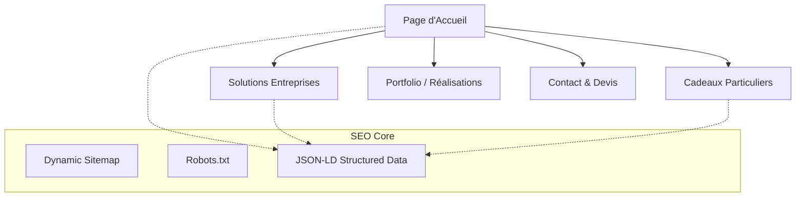

# Design Memo: SEO Strategy & Site Architecture

## Project: By Sandrine Couture
**Date:** May 12, 2026
**Objective:** Modernize the SEO infrastructure to achieve premium search visibility and sitelinks.

---

## 1. Requirements
The goal is to elevate "By Sandrine Couture" from a simple portfolio to a high-authority brand on search engines. We need to transition from basic, static SEO to a dynamic, structured approach.

### Target Audience
- **Businesses (B2B):** Professionals looking for high-end embroidery for uniforms and branding.
- **Individuals (B2C):** Customers seeking unique, personalized gifts (birth gifts, etc.).

---

## 2. SEO Analysis & Upgrade Benefits

### Current State
- Basic metadata in `layout.tsx`.
- Static `sitemap.xml`.
- Basic Schema.org (`LocalBusiness`, `Organization`).

### Proposed "2026 Standard" Upgrade
1. **Dynamic SEO Infrastructure:** Use `sitemap.ts` and `robots.ts` for real-time indexing updates.
2. **Sitelink Optimization:** Refactor site architecture to make main sections (Entreprises, Particuliers, Devis, Portfolio) explicitly clear to Google.
3. **Rich Snippets & Structured Data:** 
   - Implement `WebSite` schema for site search.
   - Implement `BreadcrumbList` on all internal pages.
   - Add `Service` schema for specific offerings.
4. **Content-Driven SEO:** Ensure H1-H3 hierarchy is strictly editorial and keyword-optimized.

### Expected Benefits
- **Premium Search Result:** Appearance of **Sitelinks** under the brand name, giving more "real estate" on the SERP.
- **Higher CTR:** Rich snippets (stars, breadcrumbs, price ranges) attract more clicks.
- **Better Conversion:** Users land on the specific page (e.g., "Entreprises") directly from search.
- **Competitive Advantage:** Stand out as the local authority in embroidery in Normandy.

---

## 3. Site Architecture (Flow)

---

## 4. Key Nodes (Pages)

| Page | Primary SEO Goal | Key Keywords |
| :--- | :--- | :--- |
| **Home (/)** | Brand Authority | By Sandrine Couture, Broderie Normandie |
| **Entreprises** | Lead Generation (B2B) | Broderie professionnelle, Uniformes personnalisés |
| **Particuliers** | Product Sales (B2C) | Cadeau naissance personnalisé, Broderie artisanale |
| **Devis** | Conversion | Devis broderie, Devis personnalisation textile |

---

## 5. Next Steps (Implementation)

1. **Phase 1:** Replace static `sitemap.xml` with dynamic `app/sitemap.ts`.
2. **Phase 2:** Update `app/layout.tsx` with enhanced metadata templates.
3. **Phase 3:** Integrate `BreadcrumbJsonLd` on all sub-pages.
4. **Phase 4:** Optimize Hero sections with the "Shopify-style" clear promise.

---

## 6. SEO & Performance Maintenance Formula

Pour maintenir un score Lighthouse > 90 et une visibilité maximale :

### Règle d'Or des Images
- **Format** : Toujours utiliser du `.webp`.
- **Dimensions** : Ne jamais envoyer une image brute (3000px+). Redimensionner à la taille d'affichage max (ex: 800px pour une carte).
- **Attributs** : Toujours spécifier `width` et `height` sur les balises `` pour éviter les sauts de mise en page (CLS).
- **Priorité** : Ajouter `priority` ou `fetchPriority="high"` sur l'image du Hero (LCP).

### Hiérarchie Sémantique
- **Titres** : Une seule balise `<h1>` par page. Suivre l'ordre `<h2>` -> `<h3>` sans sauter de niveau.
- **Landmarks** : Tout le contenu principal doit être dans une balise `<main>`.
- **Accessibilité** : Vérifier que le contraste du texte est suffisant (utiliser des gris foncés plutôt que clairs sur fond blanc).

### Monitoring Continu
- **Google Search Console** : Vérifier une fois par mois les erreurs d'indexation.
- **PageSpeed Insights** : Tester après chaque mise à jour majeure du design.
- **Sitemap** : S'assurer que le lien `/sitemap.xml` est bien déclaré dans la console Google.
